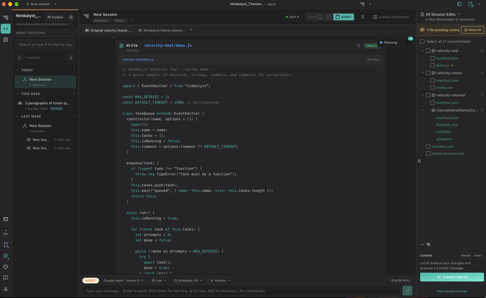
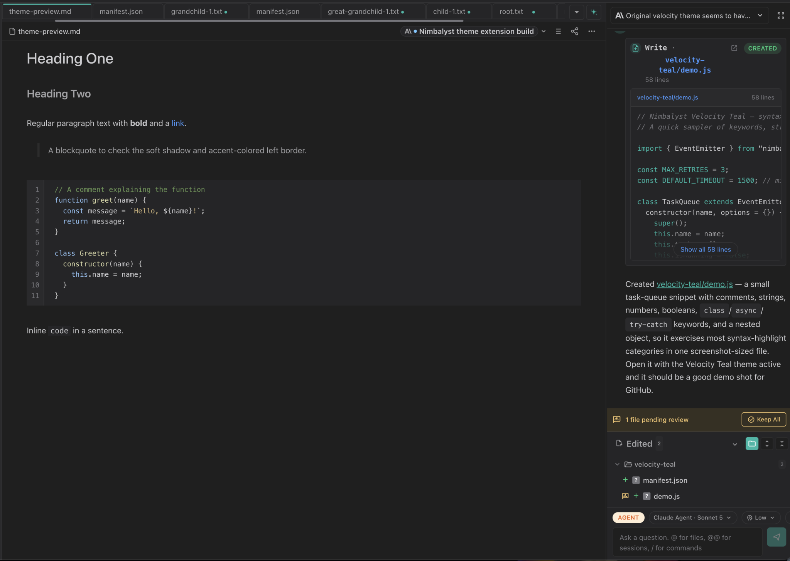

# CyberFlow

A dark near-black-blue theme for [Nimbalyst](https://nimbalyst.com) with a teal accent, purple-tinted neutrals, and a light-blue syntax highlight.





## Install

1. In Nimbalyst, enable **Extension Dev Tools** (Settings > Advanced).
2. Clone this repo somewhere on your machine:
   ```bash
   git clone https://github.com/everywhereblair/nimbalyst-theme-cyberflow.git
   ```
3. Ask your Nimbalyst AI assistant to install it:
   > "Install the Nimbalyst extension at /path/to/nimbalyst-theme-cyberflow"
4. Switch to it: Settings > Appearance > **CyberFlow**.

## Palette

| Token | Value |
| --- | --- |
| `bg` | `#1F1F1F` |
| `bg-secondary` | `#252527` |
| `bg-tertiary` | `#2A2A2C` |
| `bg-hover` | `rgba(255, 255, 255, 0.05)` |
| `bg-selected` | `rgba(20, 184, 166, 0.16)` |
| `bg-active` | `rgba(20, 184, 166, 0.22)` |
| `text` | `#CDCDD0` |
| `text-muted` | `#A2A2A5` |
| `text-faint` | `#75757A` |
| `text-disabled` | `#515156` |
| `border` | `rgba(255, 255, 255, 0.06)` |
| `border-focus` | `#14B8A6` |
| `primary` | `#14B8A6` |
| `primary-hover` | `#5EEAD4` |
| `link` | `#479AFF` |
| `link-hover` | `#8DC0FF` |
| `success` | `#18D17D` |
| `warning` | `#F8C96F` |
| `error` | `#FF4C52` |
| `info` | `#6EC6FF` |
| `purple` | `#A882FF` |

## License

MIT, see [LICENSE](LICENSE).
